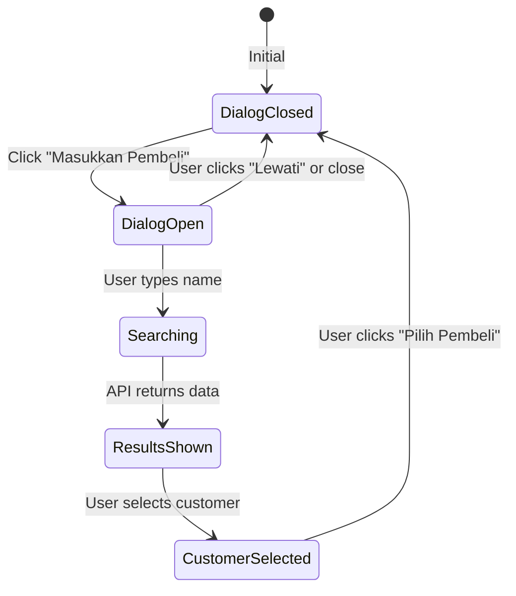

# 🎯 Dialog-Based Customer Input - Clean & Professional

## 🚀 **Dialog-Triggered Customer Selection**

Implementasi customer input menggunakan popup dialog yang dipicu dari tombol "Masukkan Pembeli" - clean, professional, dan tidak memakan space di cart.

---

## ✨ **Clean Button-Dialog Flow**

### **📱 Initial State - Clean Cart**

```
┌─────────────────────────────────────┐
│  🛒 Keranjang (2)               🗑️ │  ← Clean cart header
├─────────────────────────────────────┤
│                                     │
│  📱 iPhone 13 Pro Max              │  ← Cart items
│  Rp 15.999.000                     │
│                                     │
├─────────────────────────────────────┤
│                                     │
│  ┌─────────────────────────────────┐ │  ← Customer button
│  │ ➕ Masukkan Pembeli             │ │
│  │                                 │ │
│  └─────────────────────────────────┘ │
│  💡 Opsional - untuk receipt dan    │
│     database customer               │
├─────────────────────────────────────┤
│  Total (2 item)                     │
│  Rp 25.999.000                     │
│                                     │
│  ┌─────────────────────────────────┐ │
│  │           BAYAR                 │ │
│  └─────────────────────────────────┘ │
└─────────────────────────────────────┘
```

### **🎭 Dialog Opens - Professional Search**

```
        ┌─────────────────────────────┐
        │ 🔍 Masukkan Pembeli      ❌ │
        ├─────────────────────────────┤
        │                             │
        │  ┌───────────────────────┐   │
        │  │ 👤 Nama Pembeli       │   │  ← Auto focus
        │  │ Ketik nama pembeli... │   │
        │  └───────────────────────┘   │
        │                             │
        │  ┌───────────────────────┐   │
        │  │ 💡 Info               │   │  ← Helper card
        │  │ Ketik nama pembeli    │   │
        │  │ untuk mencari         │   │
        │  │                       │   │
        │  │ Pembeli yang sudah    │   │
        │  │ terdaftar akan muncul │   │
        │  │ dalam daftar          │   │
        │  └───────────────────────┘   │
        │                             │
        │  [Lewati]      [Pilih      ] │  ← Action buttons
        │                 Pembeli]     │
        └─────────────────────────────┘
```

### **🔍 Search Results - Smart Selection**

```
        ┌─────────────────────────────┐
        │ 🔍 Masukkan Pembeli      ❌ │
        ├─────────────────────────────┤
        │                             │
        │  ┌───────────────────────┐   │
        │  │ ✅ John              ❌│   │  ← Search with clear
        │  │                       │   │
        │  └───────────────────────┘   │
        │                             │
        │  Pilih Pembeli:              │
        │  ┌───────────────────────┐   │
        │  │ 👤 John Doe          ✅│   │  ← Selected customer
        │  │    081987654321       │   │
        │  │ 👤 John Smith         │   │  ← Other options
        │  │    081234567890       │   │
        │  └───────────────────────┘   │
        │                             │
        │  ┌───────────────────────┐   │
        │  │ ✅ John Doe           │   │  ← Confirmation card
        │  │    081987654321       │   │
        │  └───────────────────────┘   │
        │                             │
        │  [Lewati]      [Pilih      ] │  ← Enabled button
        │                 Pembeli]     │
        └─────────────────────────────┘
```

### **✅ Customer Selected - Clean Display**

```
┌─────────────────────────────────────┐
│  🛒 Keranjang (2)               🗑️ │
├─────────────────────────────────────┤
│                                     │
│  📱 iPhone 13 Pro Max              │
│  Rp 15.999.000                     │
│                                     │
├─────────────────────────────────────┤
│                                     │
│  ┌─────────────────────────────────┐ │  ← Selected customer
│  │ ✅ John Doe              ✏️  ❌ │ │
│  │    081987654321              │ │
│  └─────────────────────────────────┘ │
├─────────────────────────────────────┤
│  Total (2 item)                     │
│  Rp 25.999.000                     │
│                                     │
│  ┌─────────────────────────────────┐ │
│  │           BAYAR                 │ │
│  └─────────────────────────────────┘ │
└─────────────────────────────────────┘
```

---

## 🏗️ **Technical Implementation**

### **1. CustomerInputDialog Widget**

**File**: `lib/features/sales/presentation/widgets/customer_input_dialog.dart`

#### **🎯 Features:**

```dart
class CustomerInputDialog extends StatefulWidget {
  // Professional dialog implementation:
  // 1. Auto-focus on search field
  // 2. Real-time customer search
  // 3. Visual selection feedback
  // 4. Clear action buttons
  // 5. Helper information cards
}
```

#### **🎨 Dialog Design:**

- **Rounded dialog**: Modern Material Design 3 style
- **Auto-focus**: Search field automatically focused
- **Visual hierarchy**: Clear sections and information flow
- **Action buttons**: "Lewati" (Skip) and "Pilih Pembeli" (Select)
- **Responsive height**: Adapts to search results

### **2. Cart Sidebar Integration**

**File**: `lib/features/sales/presentation/widgets/cart_sidebar.dart`

#### **🔧 Button Implementation:**

```dart
// Customer Input Button
OutlinedButton.icon(
  onPressed: () => _showCustomerDialog(context, cartProvider),
  icon: const Icon(Icons.person_add),
  label: const Text('Masukkan Pembeli'),
  style: OutlinedButton.styleFrom(
    padding: const EdgeInsets.symmetric(vertical: 12),
    shape: RoundedRectangleBorder(borderRadius: BorderRadius.circular(8)),
    side: BorderSide(color: Colors.blue[300]!),
    foregroundColor: Colors.blue[700],
  ),
)
```

#### **💚 Selected Customer Display:**

```dart
// Selected Customer Card
Container(
  decoration: BoxDecoration(
    color: Colors.green[50],
    border: Border.all(color: Colors.green),
    borderRadius: BorderRadius.circular(8),
  ),
  child: Row(
    children: [
      Icon(Icons.check_circle, color: Colors.green),
      // Customer name and phone
      // Edit and clear buttons
    ],
  ),
)
```

---

## 🎮 **User Experience Flow**

### **📱 Dialog Interaction:**

#### **Step 1: Trigger Dialog**

1. **User klik "Masukkan Pembeli"** → Dialog terbuka
2. **Search field auto-focus** → User langsung bisa ketik
3. **Helper card visible** → User tahu apa yang harus dilakukan

#### **Step 2: Search Customer**

1. **User ketik nama** → Real-time search dimulai
2. **Results muncul** → Customer list dengan detail
3. **Visual selection** → Selected customer highlighted

#### **Step 3: Confirm Selection**

1. **User pilih customer** → Confirmation card muncul
2. **"Pilih Pembeli" button enabled** → User klik confirm
3. **Dialog closes** → Customer tersimpan di cart

#### **Step 4: Customer Management**

1. **Customer card visible** → Green confirmation display
2. **Edit button** → Re-open dialog untuk ubah
3. **Clear button** → Hapus customer selection

---

## 🎯 **Benefits Dialog Approach**

### **✅ UI/UX Advantages:**

- **Clean cart space**: Tidak memakan ruang di cart sidebar
- **Professional appearance**: Modal dialog terlihat lebih modern
- **Focused interaction**: User fokus pada customer selection
- **Better mobile UX**: Dialog lebih friendly di mobile screen

### **✅ Technical Benefits:**

- **Modular design**: Dialog component reusable
- **State management**: Clear separation of concerns
- **Error handling**: Contained within dialog scope
- **Performance**: Only loaded when needed

### **✅ Business Value:**

- **Professional POS**: Terlihat seperti aplikasi enterprise
- **User confidence**: Dialog approach lebih familiar
- **Training ease**: Clear button → dialog flow easy to understand
- **Scalability**: Easy to add more customer features in dialog

---

## 🔄 **State Management Flow**

### **🎭 Dialog States:**



### **📊 Cart Integration:**

```dart
// Button triggers dialog
_showCustomerDialog() → CustomerInputDialog()

// Dialog returns customer
selectedCustomer → cartProvider.setCustomerName/Phone()

// Cart displays customer
Customer card with edit/clear options
```

---

## 📱 **Responsive Design**

### **💻 Desktop/Tablet:**

- **Larger dialog**: More comfortable interaction space
- **Better visibility**: Search results more readable
- **Desktop-like flow**: Familiar dialog-based workflow

### **📱 Mobile:**

- **Full-screen friendly**: Dialog takes appropriate space
- **Touch-optimized**: Larger touch targets
- **Keyboard handling**: Proper keyboard interactions

---

## 🎉 **Implementation Status**

### **✅ Dialog Components Ready:**

- [x] **CustomerInputDialog**: Professional dialog with search
- [x] **Auto-focus**: Search field automatically focused
- [x] **Real-time search**: API integration working
- [x] **Visual feedback**: Selection highlighting and confirmation
- [x] **Action buttons**: Skip and confirm options

### **✅ Cart Integration Complete:**

- [x] **Button trigger**: "Masukkan Pembeli" button
- [x] **Customer display**: Green confirmation card
- [x] **Edit/Clear**: Quick action buttons
- [x] **State management**: Proper provider integration

### **✅ Cross-Platform:**

- [x] **Mobile cart sidebar**: Dialog implementation
- [x] **Tablet POS layout**: Same dialog system
- [x] **Consistent UX**: Same flow across devices

---

## 🎯 **Usage Scenarios**

### **🚀 Happy Path:**

1. **Add items to cart** → "Masukkan Pembeli" button appears
2. **Click button** → Professional dialog opens
3. **Type customer name** → Real-time search results
4. **Select customer** → Green confirmation card
5. **Click "Pilih Pembeli"** → Dialog closes, customer saved
6. **Checkout** → Customer data included in transaction

### **🎮 Alternative Flows:**

- **Skip customer** → Click "Lewati", continue without customer
- **Change customer** → Click edit icon, dialog re-opens
- **Remove customer** → Click clear icon, customer removed
- **Search no results** → "Pembeli tidak ditemukan" shown

---

**🎉 DIALOG-BASED CUSTOMER INPUT - PROFESSIONAL & CLEAN!**

✅ **Space-efficient** - Tidak memakan ruang di cart  
✅ **Professional** - Dialog approach seperti aplikasi enterprise  
✅ **User-friendly** - Clear button → dialog → selection flow  
✅ **Responsive** - Works great on mobile and desktop

Perfect untuk POS yang mengutamakan clean interface dan professional appearance! 🚀
