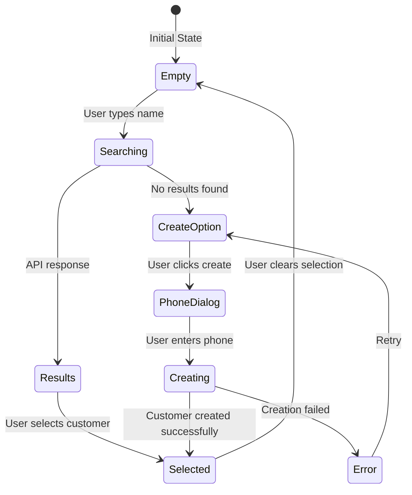

# 🎯 Smart Customer Selector - Visual Demo

## **Before vs After Comparison**

### **❌ OLD IMPLEMENTATION (Manual Input)**

```
┌─────────────────────────────────────┐
│  Customer Info (Optional)           │
│                                     │
│  ┌─────────────────────────────────┐ │
│  │ 👤 Customer Name                │ │  ← Manual typing
│  │ Enter customer name...          │ │
│  └─────────────────────────────────┘ │
│                                     │
│  ┌─────────────────────────────────┐ │
│  │ 📞 Customer Phone               │ │  ← Manual typing
│  │ Enter customer phone...         │ │
│  └─────────────────────────────────┘ │
└─────────────────────────────────────┘
```

**Issues:** Manual input, typos, no validation, duplicate customers

---

### **✅ NEW IMPLEMENTATION (Smart Selector)**

#### **1. Initial State - Empty Search**

```
┌─────────────────────────────────────┐
│  Customer (Opsional)                │
│                                     │
│  ┌─────────────────────────────────┐ │
│  │ 🔍 Nama Customer                │ │
│  │ Ketik nama customer...          │ │
│  └─────────────────────────────────┘ │
│                                     │
│  💡 Ketik nama customer untuk      │
│     mencari atau membuat yang baru  │
└─────────────────────────────────────┘
```

#### **2. User Types "John" - Search in Progress**

```
┌─────────────────────────────────────┐
│  Customer (Opsional)                │
│                                     │
│  ┌─────────────────────────────────┐ │
│  │ 🔍 John                      ⟳  │ │  ← Loading spinner
│  │                                 │ │
│  └─────────────────────────────────┘ │
└─────────────────────────────────────┘
```

#### **3. Search Results - Existing Customer Found**

```
┌─────────────────────────────────────┐
│  Customer (Opsional)                │
│                                     │
│  ┌─────────────────────────────────┐ │
│  │ 🔍 John                      ❌ │ │  ← Clear button
│  │                                 │ │
│  └─────────────────────────────────┘ │
│                                     │
│  ┌─────────────────────────────────┐ │  ← Dropdown results
│  │ 👤 John Doe                     │ │
│  │    081987654321                 │ │
│  │ 👤 John Smith                   │ │
│  │    081234567890                 │ │
│  └─────────────────────────────────┘ │
└─────────────────────────────────────┘
```

#### **4. Customer Selected - Visual Confirmation**

```
┌─────────────────────────────────────┐
│  Customer (Opsional)                │
│                                     │
│  ┌─────────────────────────────────┐ │
│  │ 🔍 John Doe                  ❌ │ │
│  │                                 │ │
│  └─────────────────────────────────┘ │
│                                     │
│  ┌─────────────────────────────────┐ │  ← Selected customer card
│  │ ✅ John Doe                     │ │
│  │    081987654321                 │ │  ← Green confirmation
│  └─────────────────────────────────┘ │
└─────────────────────────────────────┘
```

#### **5. New Customer Flow - No Results Found**

```
┌─────────────────────────────────────┐
│  Customer (Opsional)                │
│                                     │
│  ┌─────────────────────────────────┐ │
│  │ 🔍 Alice                     ❌ │ │
│  │                                 │ │
│  └─────────────────────────────────┘ │
│                                     │
│  ┌─────────────────────────────────┐ │  ← Create new option
│  │ ➕ Buat customer baru: "Alice"  │ │
│  │    Klik untuk menambah customer │ │
│  └─────────────────────────────────┘ │
└─────────────────────────────────────┘
```

#### **6. Phone Input Dialog**

```
        ┌─────────────────────────┐
        │  Nomor Telepon Customer │
        │                         │
        │  Customer: Alice        │
        │                         │
        │  ┌───────────────────┐   │
        │  │ 📞 081234567890   │   │
        │  │                   │   │
        │  └───────────────────┘   │
        │                         │
        │    [Batal]   [Simpan]   │
        └─────────────────────────┘
```

#### **7. New Customer Created & Selected**

```
┌─────────────────────────────────────┐
│  Customer (Opsional)                │
│                                     │
│  ┌─────────────────────────────────┐ │
│  │ 🔍 Alice                     ❌ │ │
│  │                                 │ │
│  └─────────────────────────────────┘ │
│                                     │
│  ┌─────────────────────────────────┐ │  ← New customer selected
│  │ ✅ Alice                        │ │
│  │    081234567890                 │ │  ← Green confirmation
│  └─────────────────────────────────┘ │
│                                     │
│  ✅ Customer "Alice" berhasil dibuat │  ← Success message
└─────────────────────────────────────┘
```

---

## **🎮 Interactive Flow Demo**

### **Scenario 1: Existing Customer (John)**

1. **User action**: Ketik "John"
2. **System response**: Show loading spinner
3. **API result**: 2 customers found (John Doe, John Smith)
4. **UI update**: Display dropdown with both options
5. **User action**: Click "John Doe"
6. **System response**: Select customer, show green card
7. **Data flow**: cartProvider.setCustomerName("John Doe") + setCustomerPhone("081987654321")

### **Scenario 2: New Customer (Alice)**

1. **User action**: Ketik "Alice"
2. **System response**: Show loading spinner
3. **API result**: No customers found
4. **UI update**: Display "Buat customer baru: Alice" option
5. **User action**: Click create option
6. **System response**: Show phone input dialog
7. **User action**: Enter phone "081234567890"
8. **API call**: Create new customer via CustomerProvider
9. **Success response**: Customer created in database
10. **UI update**: Auto-select new customer, show green card
11. **Data flow**: cartProvider.setCustomerName("Alice") + setCustomerPhone("081234567890")

---

## **🔄 State Management Flow**



---

## **📱 Mobile vs Tablet Layout**

### **Mobile Layout (Cart Sidebar)**

- **Compact design**: Smaller input fields, dense layout
- **Touch-friendly**: Larger touch targets for mobile
- **Scrollable dropdown**: Max height to fit screen

### **Tablet Layout (POS Page)**

- **Spacious design**: Larger input fields, comfortable spacing
- **Desktop-like**: More information visible at once
- **Wider dropdown**: More customer info displayed

---

## **🎯 Benefits Summary**

### **🚀 User Experience**

- **Faster workflow**: Type name → Select → Done
- **Visual feedback**: Clear indication of selection
- **Error prevention**: No manual phone input for existing customers
- **Intuitive flow**: Natural search-and-select pattern

### **📊 Data Quality**

- **Consistent data**: Same customer = same data every time
- **No duplicates**: Smart search prevents duplicate customers
- **Validated input**: Phone numbers validated during creation
- **Complete database**: Every transaction linked to customer

### **💼 Business Value**

- **Customer tracking**: All transactions linked to customers
- **Marketing ready**: Clean customer database for campaigns
- **Analytics potential**: Customer behavior analysis
- **Professional appearance**: Modern, smart POS interface

---

**🎉 SMART CUSTOMER SELECTOR - GAME CHANGER UNTUK POS!**

Transform manual customer input menjadi intelligent customer management system! 🚀
