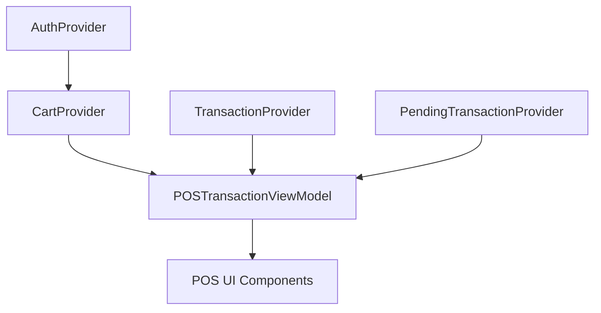

# 🔄 POSTransactionViewModel PendingTransactionProvider Integration

## 📋 Overview

Integrasi `PendingTransactionProvider` ke dalam `POSTransactionViewModel` melalui `ChangeNotifierProxyProvider3` untuk memungkinkan akses langsung ke pending transactions data dari view model.

## 🎯 Tujuan

- Memberikan akses langsung ke `PendingTransactionProvider` melalui `POSTransactionViewModel`
- Memungkinkan sinkronisasi otomatis data pending transactions
- Meningkatkan arsitektur state management dengan dependency injection yang proper

## 🔧 Implementasi

### **1. POSTransactionViewModel Enhancement**

#### **File**: `pos_transaction_view_model.dart`

**Import Addition**:

```dart
import '../../providers/pending_transaction_provider.dart';
```

**Field Addition**:

```dart
class POSTransactionViewModel extends ChangeNotifier {
  CartProvider? _cartProvider;
  TransactionProvider? _transactionProvider;
  PendingTransactionProvider? _pendingTransactionProvider; // NEW
```

**Getter Addition**:

```dart
PendingTransactionProvider? get pendingTransactionProvider => _pendingTransactionProvider;
```

**Update Method Addition**:

```dart
/// Update PendingTransactionProvider sesuai pattern dokumentasi
void updatePendingTransactionProvider(PendingTransactionProvider pendingTransactionProvider) {
  if (_pendingTransactionProvider != pendingTransactionProvider) {
    _pendingTransactionProvider = pendingTransactionProvider;
    // Tidak perlu notifyListeners() karena PendingTransactionProvider changes tidak mempengaruhi UI langsung
  }
}
```

### **2. Main.dart Provider Configuration**

#### **Before**: `ChangeNotifierProxyProvider2`

```dart
ChangeNotifierProxyProvider2<
  CartProvider,
  TransactionProvider,
  POSTransactionViewModel
>(
  update: (_, cartProvider, transactionProvider, viewModel) {
    viewModel.updateCartProvider(cartProvider);
    viewModel.updateTransactionProvider(transactionProvider);
    return viewModel;
  },
)
```

#### **After**: `ChangeNotifierProxyProvider3` ✅

```dart
ChangeNotifierProxyProvider3<
  CartProvider,
  TransactionProvider,
  PendingTransactionProvider,
  POSTransactionViewModel
>(
  update: (_, cartProvider, transactionProvider, pendingTransactionProvider, viewModel) {
    viewModel.updateCartProvider(cartProvider);
    viewModel.updateTransactionProvider(transactionProvider);
    viewModel.updatePendingTransactionProvider(pendingTransactionProvider); // NEW
    return viewModel;
  },
)
```

## 🏗️ Arsitektur Benefits

### **1. Dependency Injection**

- `PendingTransactionProvider` secara otomatis diinjeksikan ke `POSTransactionViewModel`
- Tidak perlu manual `Provider.of<PendingTransactionProvider>()` di widget

### **2. State Synchronization**

- Perubahan di `PendingTransactionProvider` otomatis tersinkronisasi
- View model selalu memiliki reference terbaru ke provider

### **3. Cleaner Code**

- Akses pending transactions melalui view model: `viewModel.pendingTransactionProvider`
- Konsisten dengan pattern yang sudah ada untuk `CartProvider` dan `TransactionProvider`

## 🎮 Usage Examples

### **Before Enhancement**

```dart
// Di widget, perlu manual access provider
final pendingProvider = Provider.of<PendingTransactionProvider>(context, listen: false);
await pendingProvider.loadPendingTransactions();
```

### **After Enhancement** ✅

```dart
// Melalui view model, lebih clean dan konsisten
final viewModel = Provider.of<POSTransactionViewModel>(context, listen: false);
await viewModel.pendingTransactionProvider?.loadPendingTransactions();
```

## 🔄 Provider Dependency Flow



## 📊 Impact Analysis

| Aspect                   | Before                 | After                  | Improvement     |
| ------------------------ | ---------------------- | ---------------------- | --------------- |
| **Provider Access**      | Manual `Provider.of()` | Through ViewModel      | Cleaner code    |
| **State Management**     | Independent providers  | Coordinated through VM | Better sync     |
| **Dependency Injection** | Partial                | Complete               | Full DI pattern |
| **Code Consistency**     | Mixed patterns         | Unified pattern        | Maintainable    |

## 🧪 Testing Scenarios

### **Test Case 1: Provider Injection**

1. Navigate to POS page
2. Access `POSTransactionViewModel`
3. Verify `pendingTransactionProvider` is not null
4. Verify it's the same instance as global provider

### **Test Case 2: State Synchronization**

1. Make changes through global `PendingTransactionProvider`
2. Access through `viewModel.pendingTransactionProvider`
3. Verify changes are reflected
4. Confirm data consistency

### **Test Case 3: Method Access**

```dart
final viewModel = Provider.of<POSTransactionViewModel>(context, listen: false);

// Should work without errors
await viewModel.pendingTransactionProvider?.loadPendingTransactions();
await viewModel.pendingTransactionProvider?.savePendingTransaction(...);
final transactions = viewModel.pendingTransactionProvider?.pendingTransactionsList;
```

## 🚀 Migration Path

### **Existing Code Compatibility**

- ✅ **No Breaking Changes**: Existing `Provider.of<PendingTransactionProvider>()` still works
- ✅ **Gradual Migration**: Can migrate to view model access incrementally
- ✅ **Backward Compatible**: Old patterns continue to function

### **Recommended Migration**

```dart
// OLD: Direct provider access
final pendingProvider = Provider.of<PendingTransactionProvider>(context);

// NEW: Through view model (recommended)
final viewModel = Provider.of<POSTransactionViewModel>(context);
final pendingProvider = viewModel.pendingTransactionProvider;
```

## 📋 Implementation Checklist

- ✅ **Import Statement**: Added `pending_transaction_provider.dart` import
- ✅ **Field Addition**: Added `_pendingTransactionProvider` field
- ✅ **Getter Method**: Added public getter for provider access
- ✅ **Update Method**: Added `updatePendingTransactionProvider()` method
- ✅ **Main Provider**: Changed to `ChangeNotifierProxyProvider3`
- ✅ **Dependency Injection**: Added provider to update callback
- ✅ **Error Handling**: No linting errors or compile issues

## 🔄 Related Enhancements

This enhancement works perfectly with other recent implementations:

1. ✅ **API Pending Transactions** - Full API integration
2. ✅ **Transaction Loading After Auth** - Load after login
3. ✅ **Splash Screen Loading** - Load during app init
4. ✅ **POS Cart Update Loading** - Load after cart changes
5. ✅ **View Model Integration** - Clean provider access (this implementation)

---

**Enhancement Completed**: ✅  
**Date**: January 2025  
**Impact**: Improved architecture and cleaner code access  
**Status**: Production ready - no breaking changes  
**Pattern**: Follows existing `CartProvider` and `TransactionProvider` integration pattern
